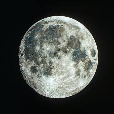

# Image to Ascii (C / stb_image)
Simple program that transforms an image to text(ascii), written in C using stb_image.

# Example
Input:

Output:

# Features and Thechnologies
**Support** Works for .PNG, .JPG, .BMP

**Language** C(C99+)

**Extern Lib** [stb_image.h](https://github.com/nothings/stb) (Single-header image processing library)
